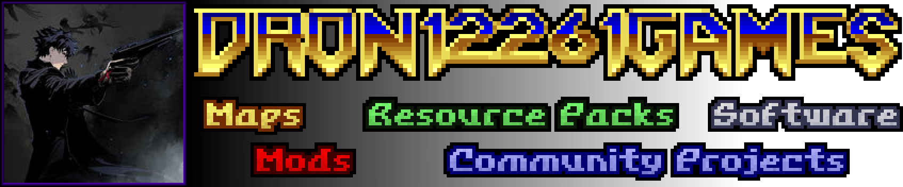

### Hi. I'm DRON12261 (Andrey Skochko) - a level designer, modder, programmer, a little bit of graphic artist and game developer.  Welcome to the vault of my projects related to Doom and not only. There are gameplay mods and full-fledged maps to play through, as well as resource packs for mapping and modding, and entire large community projects. Here you can also see my projects that are in progress or have been canceled and not posted anywhere else.

My youtube channel: [Youtube](https://www.youtube.com/@dron12261)

My wiki page: [Doom Wiki](https://doomwiki.org/wiki/Andrey_Skochko_(DRON12261))

### To other authors of their projects:
You can take whatever you want from the repository for your projects, BUT you must put my authorship in your project, AND if my project that you take something from also has its `CREDITS.txt`, `README.TXT`, etc. (either in the repository itself, or inside .wad, .pke, .pk3, etc.) with the description of other authors, you must necessarily study it and put the corresponding authorship of the resource that you take from the project. There is no need to ask me for any permission, just try to adhere to this rule, it will be more than enough.

### You can understand by the prefix in the repository name to see what is stored there:
- `MOD-` - This repository contains the gameplay mod;
- `WAD-` - This repository contains a map or an entire megawad;
- `RES-` - This repository contains resources I've created for later use in mapping or modding.
- `SFT-` - This repository contains some software related to Doom.
- `CPL-` - This repository contains community projects hosted by me.
- `GFT-` - This repository contains projects not made by me, but made as a gift for me by the community.
- `OTH-` - This repository contains all sorts of other things.

Updated as of `9 January 2025`.

### List of my projects:
Mods (`MOD-`) :
| № | PROJECT NAME | STATUS | VERSION |
| :---: | :--- | :---: | :---: |
| 1 | [VanillaPSX](https://github.com/dron12261games/MOD-VanillaPSX) | ```✅RELEASED``` | ```v6``` |
| 2 | [VHS&CRT Shader Mod](https://github.com/dron12261games/MOD-VHS-CRT-Shader-by-DRON12261) | ```✅RELEASED``` | ```v2``` |
| 3 | [Complex Doom Evolved](https://github.com/dron12261games/MOD-Complex-Doom-Evolved) | ```🧊FROZEN``` | ```v0.1``` |
| 4 | DOOM Death Calls | ```🧊FROZEN``` | ```PUBLICLY UNAVAILABLE``` |

WADs (`WAD-`):
| № | PROJECT NAME | STATUS | VERSION |
| :---: | :--- | :---: | :---: |
| 1 | [DOOM PSX: Damnation of Eternity (🏆EMC2024 Winner🥈🏆)](https://github.com/dron12261games/WAD-DOOM-PSX-Damnation-of-Eternity-EMC2024) | ```✅RELEASED``` |  |
| 2 | [Scythe Reforged - Teaser [MAP20]](https://github.com/dron12261games/WAD-Scythe-Reforged) | ```✅RELEASED``` |  |
| 3 | [The Lost Shores (MAP07 for Constriction 1024)](https://github.com/dron12261games/WAD-Constriction1024-MAP07) | ```✅RELEASED``` | ```v5``` |
| 4 | [Hotel of the Dead](https://github.com/dron12261games/WAD-Hotel-of-the-Dead) | ```✅RELEASED``` | ```v4``` |
| 5 | [Tribute Quilt Community Project (E4M7 and E4M9 pieces)](https://github.com/dron12261games/WAD-Tribute-Quilt-Pieces) | ```✅RELEASED``` |  |
| 6 | [Marching in the Darkness (E2M5 for Death by 1000 Lines)](https://github.com/dron12261games/WAD-Death-by-1000-Lines-E2M5) | ```✅RELEASED``` |  |
| 7 | [Light! Camera! BOOM!](https://github.com/dron12261games/WAD-Light-Camera-BOOM) | ```✅RELEASED``` |  |
| 8 | [ShovelDM Maps (MAP02, MAP05, MAP09)](https://github.com/dron12261games/WAD-ShovelDM-Maps) | ```✅RELEASED``` |  |
| 9 | [Metallic Highway CTF (feat EXWiz, MAP04 for FrenzyCTF)](https://github.com/dron12261games/WAD-Metallic-Highway) | ```✅RELEASED``` |  |
| 10 | [Coolmap2014](https://github.com/dron12261games/WAD-Coolmap2014) | ```✅RELEASED``` |  |
| 11 | [Monumentum (Old map piece for UNFINISHED.WAD)](https://github.com/dron12261games/WAD-Monumentum) | ```✅RELEASED``` |  |
| 12 | [Definitive Doom](https://github.com/dron12261games/WAD-Definitive-Doom) | ```📦EARLY RELEASE``` | ```v0.1``` |
| 13 | [DRON12261 DM Pack](https://github.com/dron12261games/WAD-DRON12261-DM-Pack) | ```📦EARLY RELEASE``` | ```v4``` |
| 14 | [The Living Abyss on my Painting](https://github.com/dron12261games/WAD-The-Living-Abyss-in-my-Painting) | ```🏁WIP``` |  |
| 15 | [Collapsing Dreams (MAP32 for Laocoön Quick Maps)](https://github.com/dron12261games/WAD-Collapsing-Dreams) | ```🏁WIP``` |  |
| 16 | [Toxicomplexis](https://github.com/dron12261games/WAD-Toxicomplexis) | ```🏁WIP``` |  |
| 17 | [Mountain of Fears](https://github.com/dron12261games/WAD-Mountain-of-Fears) | ```🏁WIP``` |  |
| 18 | [Hotel of the Dead PSX](https://github.com/dron12261games/WAD-Hotel-of-the-Dead-PSX) | ```🧊FROZEN``` |  |
| 19 | [Perdition's Gate: Flashback](https://github.com/dron12261games/WAD-Perditions-Gate-Flashback) | ```🧊FROZEN``` |  |
| 20 | [DOOM PSX: Frontier of Agony](https://github.com/dron12261games/WAD-DOOM-PSX-Frontier-of-Agony) | ```🧊FROZEN``` |  |
| 21 | [MidNightmare](https://github.com/dron12261games/WAD-MidNightmare) | ```🧊FROZEN``` |  |
| 22 | [Purity of Fame](https://github.com/dron12261games/WAD-Purity-of-Fame) | ```🧊FROZEN``` |  |
| 23 | [Remember 2 it](https://github.com/dron12261games/WAD-Remember-2-it) | ```🧊FROZEN``` |  |
| 24 | [Eternity Engine Colormaps Tech Demo](https://github.com/dron12261games/WAD-Eternity-Engine-Colormaps-Tech-Demo) | ```⛔CANCELLED``` |  |
| 25 | [Egeon's Awakening](https://github.com/dron12261games/WAD-Egeons-Awakening) | ```⛔CANCELLED``` |  |
| 26 | [Welcome64](https://github.com/dron12261games/WAD-Welcome64) | ```⛔CANCELLED``` |  |
| 27 | [Map for Blocked-Out Community Project](https://github.com/dron12261games/WAD-Blocked-Out) | ```⛔CANCELLED``` |  |
| 28 | [The Dark Side of Phobos REMAKE](https://github.com/dron12261games/WAD-TDSOP-Remake) | ```⛔CANCELLED``` |  |
| 29 | [Maps for Nomakh's Mapping Workshop Project](https://github.com/dron12261games/WAD-NMW-Maps) | ```⛔CANCELLED``` |  |
| 30 | [Go 2 Id](https://github.com/dron12261games/WAD-Go-2-Id) | ```⛔CANCELLED``` |  |

Resources (`RES-`):
| № | PROJECT NAME | STATUS | VERSION |
| :---: | :--- | :---: | :---: |
| 1 | [Big COLORMAPs Pack for Eternity Engine (colored sector lighting and colored fog)](https://github.com/dron12261games/RES-Big-Colormap-Pack-for-Eternity-Engine) | ```✅RELEASED``` |  |
| 2 | [WraithCorp Textures](https://github.com/dron12261games/RES-WraithCorpTex) | ```✅RELEASED``` |  |
| 3 | [DOOM PSX Textures](https://github.com/dron12261games/RES-PSXTex) | ```✅RELEASED``` |  |
| 4 | [Lighting Textures](https://github.com/dron12261games/RES-Lighting-Textures) | ```✅RELEASED``` |  |
| 5 | [UltimateDTex](https://github.com/dron12261games/RES-UltimateDTex) | ```✅RELEASED``` | ```Beta 3``` |
| 6 | [CyberTechTEX](https://github.com/dron12261games/RES-CyberTechTEX) | ```✅RELEASED``` |  |
| 7 | [DRON12261 Announcer](https://github.com/dron12261games/RES-DRON12261-Announcer) | ```✅RELEASED``` |  |
| 8 | [ColossalDTex [8200+ Texture Pack]](https://github.com/dron12261games/RES-ColossalDTex) | ```📦EARLY RELEASE``` |  |
| 9 | [ETERNUM Resource Pack for Eternity Engine](https://github.com/dron12261games/RES-Eternum-Resource-Pack) | ```🏁WIP``` |  |
| 10 | [OTEX Extra Textures](https://github.com/dron12261games/RES-OTEX-EXTRA) | ```⛔CANCELLED``` |  |

Software (`SFT-`):
| № | PROJECT NAME | STATUS | VERSION |
| :---: | :--- | :---: | :---: |
| 1 | [GZDoom Classic [Correctly Preconfigured Build]](https://github.com/dron12261games/SFT-GZDoom-Classic) | ```✅RELEASED``` | ```v4``` |
| 2 | [Dron's Doom Utils](https://github.com/dron12261games/SFT-DronsDoomUtils) | ```📦EARLY RELEASE``` | ```v0.2``` |

Community Projects (`CPL-`):
| № | PROJECT NAME | STATUS | VERSION |
| :---: | :--- | :---: | :---: |
| 1 | [Russian Random Speedmap Pack #1](https://github.com/dron12261games/CPL-RRSP1) | ```✅RELEASED``` |  |
| 2 | [Russian Random Speedmap Pack #2](https://github.com/dron12261games/CPL-RRSP2) | ```✅RELEASED``` |  |
| 3 | [Russian Random Speedmap Pack #3](https://github.com/dron12261games/CPL-RRSP3) | ```✅RELEASED``` | ```v1.0.7``` |
| 4 | [Russian Random Speedmap Pack #4](https://github.com/dron12261games/CPL-RRSP4) | ```🧊FROZEN``` |  |

Gifts for me (`GFT-`):
| № | PROJECT NAME | STATUS | VERSION |
| :---: | :--- | :---: | :---: |
| 1 | [Gift for DRON12261](https://github.com/dron12261games/GFT-Gift-for-DRON12261) | ```✅RELEASED``` |  |

Other (`OTH-`):
| № | PROJECT NAME | STATUS | VERSION |
| :---: | :--- | :---: | :---: |
| 1 | [Demo walkthroughs by DRON12261](https://github.com/dron12261games/OTH-Demos-by-DRON12261) | ```💼STORAGE ONLY``` |  |
| 2 | [Other random unreleased/unfinished/test things](https://github.com/dron12261games/OTH-My-Random-Stuff) | ```💼STORAGE ONLY``` |  |
| 3 | [Eternity Engine Test Field](https://github.com/dron12261games/WAD-Eternity-Engine-Test-Field) | ```💼STORAGE ONLY``` |  |

### If you want to support me and my creativity:
Donation Alerts: https://www.donationalerts.com/r/dron12261


